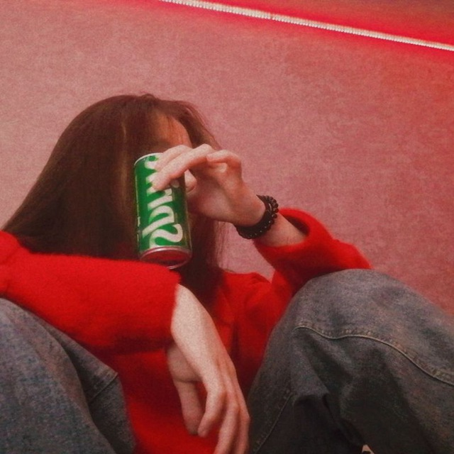

<html lang="ru">
<head>
    <meta charset="UTF-8">
    <meta name="viewport" content="width=device-width, initial-scale=1.0">
    <title>Послание</title>
    
</head>
<body>
    <h1>Я люблю тебя, милая!</h1>
    
Ты самая лучшая на свете!

    
    

        
        
        
    

    <!-- Сердечки, разбросанные по странице -->
    
&#10084;

    
&#10084;

    
&#10084;

    
&#10084;

    
&#10084;

    
&#10084;

    
&#10084;

    
&#10084;

    
&#10084;

    
&#10084;

</body>
</html>
